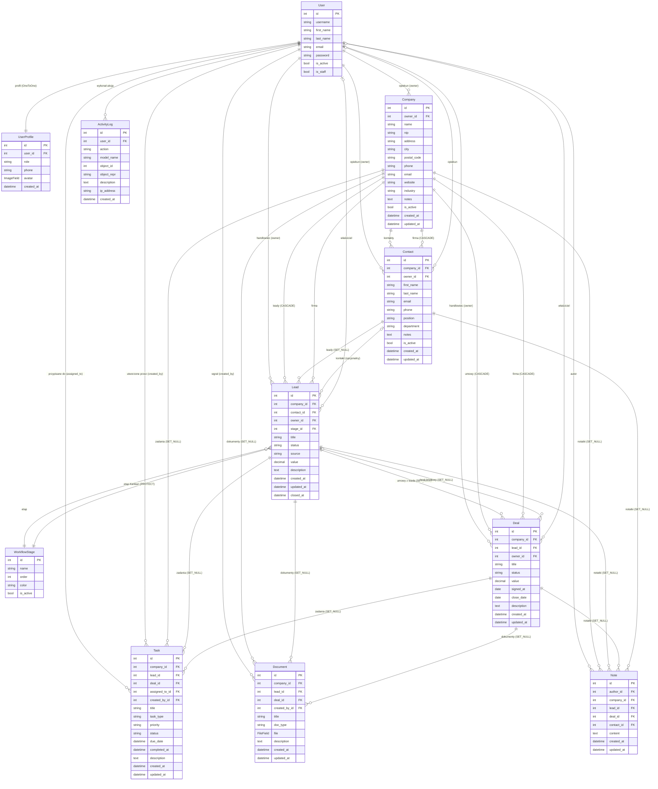

# ZelaznaCRM — Diagram ERD (Entity-Relationship Diagram)

Diagram relacji między modelami systemu ZelaznaCRM.
Wygenerowany: Kwiecień 2026 | Django 5.x | 10 modeli, 9 aplikacji

---

## Diagram Mermaid

---

## Legenda relacji

| Symbol Mermaid | Znaczenie | Django on_delete |
|----------------|-----------|-----------------|
| `\|\|--\|\|` | Jeden do jeden | OneToOneField |
| `\|\|--o{` | Jeden do wielu (wymagany) | CASCADE / PROTECT |
| `}o--o\|` | Wiele do jeden (opcjonalny FK) | SET_NULL |
| `}o--\|\|` | Wiele do jeden (wymagany FK) | CASCADE |

---

## Podsumowanie modeli

| Model | Aplikacja | Klucze obce (FK) | Opis |
|-------|-----------|-----------------|------|
| `User` | django.auth | — | Wbudowany model Django |
| `UserProfile` | accounts | User (OneToOne) | Rozszerzenie profilu (rola, telefon, avatar) |
| `Company` | companies | User (owner) | Firma-klient CRM |
| `Contact` | contacts | Company, User (owner) | Osoba kontaktowa w firmie |
| `WorkflowStage` | leads | — | Etap lejka Kanban |
| `Lead` | leads | Company, Contact, User, WorkflowStage | Szansa sprzedaży |
| `Deal` | deals | Company, Lead, User | Umowa handlowa |
| `Task` | tasks | Company, Lead, Deal, User×2 | Zadanie CRM z terminem |
| `Document` | documents | Company, Lead, Deal, User | Plik lub dokument PDF |
| `Note` | notes | User, Company, Lead, Deal, Contact | Notatka tekstowa |
| `ActivityLog` | reports | User | Niemutowalny log zdarzeń |

---

## Renderowanie diagramu

Aby wyświetlić diagram Mermaid:
- **VS Code:** rozszerzenie *Markdown Preview Mermaid Support*
- **GitHub:** diagramy Mermaid renderowane natywnie w plikach `.md`
- **Online:** [mermaid.live](https://mermaid.live)
- **PNG:** plik `ERD.png` w katalogu głównym projektu
