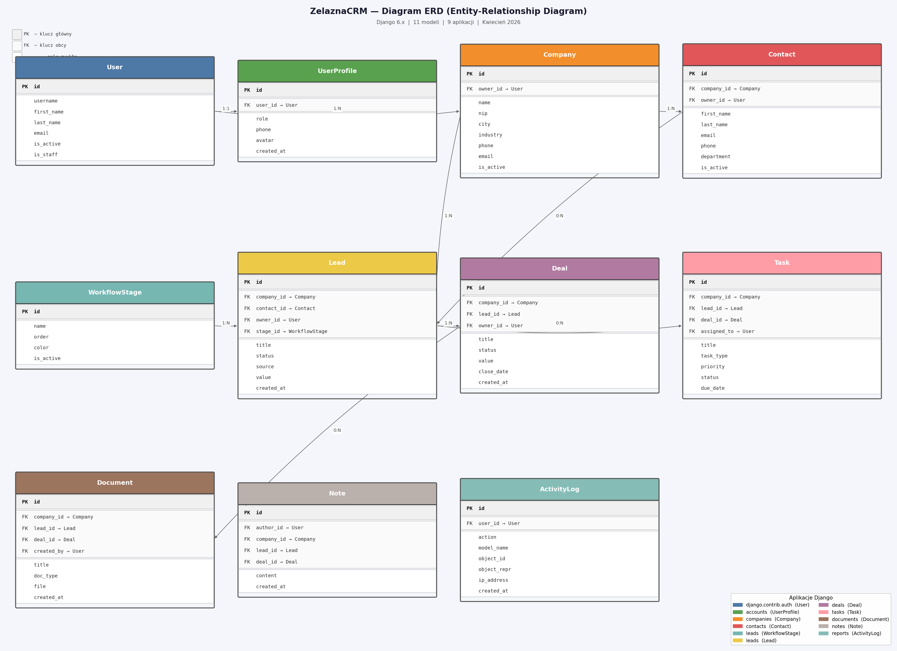

# ZelaznaCRM

System CRM (Customer Relationship Management) dla małych zespołów sprzedażowych, zbudowany jako projekt dyplomowy w Django.

## Opis projektu

ZelaznaCRM to webowy system zarządzania relacjami z klientami przeznaczony dla małych i średnich firm. Umożliwia zarządzanie firmami, kontaktami, leadami, umowami, zadaniami i dokumentami w jednym miejscu. System posiada dwa poziomy dostępu: **Administrator** (pełny dostęp do wszystkich danych) i **Handlowiec** (dostęp tylko do własnych rekordów).

### Funkcjonalności

| Moduł | Opis |
|---|---|
| **Firmy** | Kartoteka klientów z branżami, NIP, danymi kontaktowymi |
| **Kontakty** | Osoby kontaktowe powiązane z firmami |
| **Leady** | Lejek sprzedażowy z tablicą Kanban i etapami workflow |
| **Umowy** | Zarządzanie kontraktami z wartością i statusem |
| **Zadania** | Aktywności (telefon, spotkanie, e-mail) z kalendarzem |
| **Dokumenty** | Oferty, umowy, faktury z pobieraniem plików |
| **Notatki** | Notatki powiązane z firmami, leadami, umowami |
| **Raporty** | Dashboard KPI, logi aktywności, raport sprzedaży per handlowiec |
| **Konta** | Zarządzanie użytkownikami i profilami (ADMIN) |

---

## Stack technologiczny

- **Backend:** Python 3.14 · Django 6.0.2
- **Baza danych:** SQLite (deweloperska) · PostgreSQL (produkcja)
- **Frontend:** Bootstrap 5 via [Tabler](https://tabler.io/) · Django Template Language
- **Formularze:** django-crispy-forms z layoutem Tabler/Bootstrap 5
- **Testy:** pytest-django · coverage
- **Jakość kodu:** black · flake8 · isort · pre-commit

---

## Wymagania systemowe

- Python 3.12+
- pip
- Git
- (opcjonalnie) PostgreSQL 14+ dla środowiska produkcyjnego

---

## Instalacja krok po kroku

### 1. Klonowanie repozytorium

```bash
git clone https://github.com/WaldemarZelazny/zelaznacrm.git
cd zelaznacrm/ZelaznaCRM
```

### 2. Tworzenie środowiska wirtualnego

```bash
python -m venv .venv

# Windows
.venv\Scripts\activate

# Linux / macOS
source .venv/bin/activate
```

### 3. Instalacja zależności

```bash
pip install -r requirements/development.txt
```

### 4. Instalacja Playwright (scraping RRUP)

```bash
playwright install chromium
```

### 5. Migracje bazy danych

```bash
python manage.py migrate
```

### 6. Dane demonstracyjne

```bash
python manage.py seed_demo_data
```

Opcja `--clear` usuwa istniejące dane przed ponownym seedowaniem:

```bash
python manage.py seed_demo_data --clear
```

### 7. Uruchomienie serwera deweloperskiego

> **Uwaga:** Przed uruchomieniem upewnij się że nie ma starych procesów Django:
> - Windows: `taskkill /F /IM python.exe`
> - macOS/Linux: `pkill -f "manage.py runserver"`

```bash
python manage.py runserver
```

Aplikacja dostępna pod adresem: **http://127.0.0.1:8000/**

#### Szybki start (Windows)

Uruchom skrypt `start_zelaznaCRM.bat` — aktywuje virtualenv, otwiera przeglądarkę i startuje serwer.

Aby utworzyć skrót na pulpicie z ikoną aplikacji:

```bat
cscript create_shortcut.vbs
```

---

## Dane testowe

Po wykonaniu `seed_demo_data` dostępne są dwa konta demonstracyjne:

| Login | Hasło | Rola |
|---|---|---|
| `admin` | `Admin1234!` | Administrator — dostęp do wszystkich danych i raportów |
| `jan.kowalski` | `Handlowiec1!` | Handlowiec — dostęp tylko do własnych rekordów |

Dane obejmują: 10 firm, 20 kontaktów, 15 leadów, 10 umów, 20 zadań, 10 notatek.

---

## Struktura projektu

```
ZelaznaCRM/
├── apps/
│   ├── accounts/       # Użytkownicy, role, profile
│   ├── companies/      # Firmy + management commands
│   ├── contacts/       # Kontakty
│   ├── dashboard/      # Strona główna po zalogowaniu
│   ├── deals/          # Umowy handlowe
│   ├── documents/      # Dokumenty i pliki
│   ├── leads/          # Leady i kanban
│   ├── notes/          # Notatki
│   ├── reports/        # Raporty i logi aktywności
│   └── tasks/          # Zadania i kalendarz
├── config/
│   ├── settings/
│   │   ├── base.py
│   │   ├── development.py
│   │   └── test.py
│   └── urls.py
├── requirements/
│   ├── base.txt
│   └── development.txt
├── static/
│   └── tabler/         # Pliki CSS/JS Tabler
├── templates/          # Szablony HTML
├── manage.py
└── .env.example
```

---

## Uruchamianie testów

```bash
# Wszystkie testy
pytest

# Z raportem pokrycia
pytest --cov=apps --cov-report=html

# Raport HTML dostępny w htmlcov/index.html
```

Aktualny wynik: **664 testy, 100% passing**.

---

## Zmienne środowiskowe

Skopiuj `.env.example` do `.env` i uzupełnij wartości:

```bash
cp .env.example .env
```

Kluczowe zmienne:

```env
SECRET_KEY=twoj-tajny-klucz
DEBUG=True
DATABASE_URL=sqlite:///db.sqlite3
```

---

## Statystyki projektu

| Kategoria | Pliki | Linie kodu |
|-----------|------:|----------:|
| Python — kod aplikacji | 93 | ~8 500 |
| Python — testy | 36 | ~7 579 |
| HTML szablony | 44 | ~5 636 |
| Dokumentacja (MD/RST) | 140+ | ~3 634 |
| **Kod własny łącznie** | **313+** | **~25 349** |

- ✅ 664 testy automatyczne (100% passing)
- ✅ 46% kodu to testy — wysoka kultura testowania
- ✅ 9 aplikacji Django, 11 modeli
- ✅ 54 widoki CBV/FBV z `LoginRequiredMixin`

---

## Rozwiązywanie problemów

Szczegółowe rozwiązania problemów znajdziesz w pliku [LESSONS_LEARNED.md](LESSONS_LEARNED.md).

---

## Diagram ERD

Diagram relacji między modelami (Entity-Relationship Diagram):



Pełny diagram w formacie Mermaid: [ERD.md](ERD.md)

---

## Dokumentacja projektu

| Plik | Opis |
|---|---|
| [CLAUDE.md](CLAUDE.md) | Instrukcje i standardy dla Claude Code |
| [CONTEXT.md](CONTEXT.md) | Kontekst projektu, stack, plan realizacji |
| [LESSONS_LEARNED.md](LESSONS_LEARNED.md) | Rozwiązane problemy i wnioski z realizacji |
| [CHANGELOG.md](CHANGELOG.md) | Historia zmian per faza |
| [ERD.md](ERD.md) | Diagram ERD — modele i relacje (Mermaid) |
| [USER_MANUAL.md](USER_MANUAL.md) | Instrukcja obsługi użytkownika |
| [DIPLOMA_REQUIREMENTS.md](DIPLOMA_REQUIREMENTS.md) | Raport spełnienia wymagań pracy dyplomowej |
| [PROJECT_SUMMARY.md](PROJECT_SUMMARY.md) | Kompletne podsumowanie projektu — wnioski, wzorce, szablon startowy |

---

## Pierwsze kroki dla Claude Code

Przed rozpoczęciem pracy przeczytaj:

```
Przeczytaj CLAUDE.md, CONTEXT.md i LESSONS_LEARNED.md — kontynuujemy ZelaznaCRM.
```

---

## Licencja

Projekt akademicki — praca dyplomowa. Wszelkie prawa zastrzeżone.
